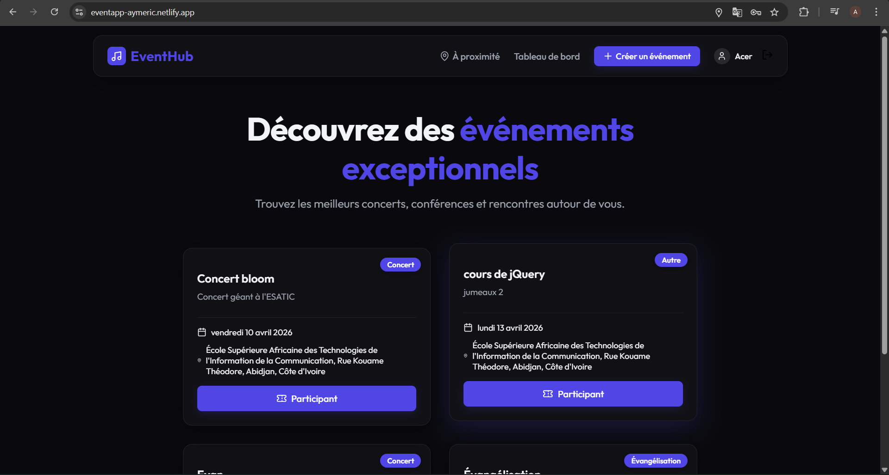

 

  
  <h1 align="center">EventHub - Plateforme de Gestion d'Événements</h1>
  
  

    Une application Full-Stack complète pour découvrir, créer et gérer des événements géolocalisés avec système de billetterie par QR Code.
     
     
    <a href="https://eventlapp-aymeric.netlify.app/"><strong>Voir la démo en direct »</strong></a>
     
  

  
  
  
  
  

 

## 📸 Aperçu

*(Aperçu de la page d'accueil avec le design sombre et Glassmorphism)*

---

## ✨ Fonctionnalités Principales

- 🔐 **Authentification Sécurisée** : Inscription et connexion gérées via JWT (Access & Refresh tokens).
- 📍 **Découverte Géolocalisée** : Moteur de recherche d'événements basé sur votre position GPS (MongoDB `$near` queries).
- 📝 **Création d'Événements** : Interface fluide pour publier des activités (Concerts, Formations, etc.) avec adresses et dates.
- 🎟️ **Billet Électronique & QR Code** : À chaque inscription, l'utilisateur reçoit un email de confirmation contenant un QR Code unique généré dynamiquement.
- 📱 **Dashboard Créateur / Scanner** : Interface dédiée aux organisateurs permettant de scanner le QR Code des participants en temps réel pour valider leur entrée.
- 🎨 **UI/UX Premium** : Interface entièrement responsive avec un thème sombre élégant et des effets *Glassmorphism*.

---

## 🏗️ Architecture Technique

### 💻 Frontend (Client)
- **Framework** : React + ViteJS
- **Routage** : React Router DOM (Navigation protégée)
- **Styling** : Vanilla CSS moderne (Variables, Flexbox/Grid, Animations)
- **Icônes** : Lucide React

### ⚙️ Backend (Serveur)
- **Environnement** : Node.js & Express.js
- **Base de Données** : MongoDB (avec `mongoose`) proposant des index Geospatiaux (2dsphere).
- **Sécurité** : `jsonwebtoken` (JWT), `bcryptjs`, Middlewares personnalisés.
- **Service Emailing** : API Brevo (anciennement Sendinblue) avec gestion de requêtes HTTP.
- **Génération QR** : Librairie `qrcode`.

---

## 🚀 Installation & Exécution (Local)

Pour faire tourner le projet sur votre machine locale, suivez ces étapes :

### 1. Prérequis
- [Node.js](https://nodejs.org/) installé (v16+ recommandée)
- Une base de données [MongoDB](https://www.mongodb.com/) (locale ou Atlas)
- Un compte [Brevo](https://www.brevo.com/) pour récupérer une clé API email.

### 2. Cloner le dépôt
\`\`\`bash
git clone https://github.com/VOTRE_NOM/event_app.git
cd event_app
\`\`\`

### 3. Configuration du Backend
\`\`\`bash
cd backend
npm install
\`\`\`
Créez un fichier `.env` dans le dossier `backend` et ajoutez vos variables :
\`\`\`env
PORT=5000
MONGODB_URI=votre_lien_mongodb
JWT_ACCESS_SECRET=votre_secret_access
JWT_REFRESH_SECRET=votre_secret_refresh
JWT_TICKET_SECRET=votre_secret_tickets
BREVO_API_KEY=votre_cle_api_brevo
BREVO_FROM_EMAIL=votre_email_expediteur@domaine.com
BREVO_SENDER_NAME="EventHub Team"
\`\`\`
Lancez le serveur :
\`\`\`bash
npm run dev
\`\`\`

### 4. Configuration du Frontend
Ouvrez un nouveau terminal et naviguez dans le frontend :
\`\`\`bash
cd frontend
npm install
\`\`\`
Créez un fichier `.env` dans le dossier `frontend` :
\`\`\`env
VITE_API_URL=http://localhost:5000
\`\`\`
Lancer l'application :
\`\`\`bash
npm run dev
\`\`\`

---

## 🎫 Exemple du Système de QR Code

Lorsqu'un utilisateur rejoint un événement, le backend génère un token chiffré et le transmet via l'API Brevo. 

  

<i>Exemple de QR code généré automatiquement et transmis en pièce jointe.</i>

Lors de l'arrivée du participant, l'organisateur utilise la fonction **Scanner Ticket** depuis son dashboard pour certifier l'entrée !

---

## 👨‍💻 Développé par
**Aymeric N'ZORE** - Développeur Full-Stack
